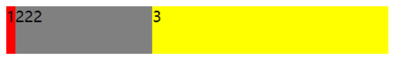
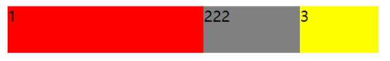
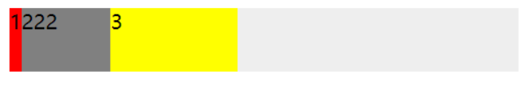

```
传统的布局是基于盒模型，依赖display属性 + position属性 + float属性；
对于一些特殊的布局实现起来非常不方便，比如：垂直居中就不容易实现。
Flex布局则可以简便、完整、响应式地实现各种页面布局；目前，已经得到所有浏览器地支持(IE10+)。
```
# Flex布局 - 弹性布局(Flexible Box)
### 任何一个容器都可以指定为Flex布局
```
    .box{
        display:flex;
    }
```
+ 行内元素也可以使用Flex布局
```
    .box{
        display:inline-flex;
    }
```
+ Webkit内核的浏览器，必须加上-webkit前缀
```
    .box{
        display:-webkit-flex;
        display:flex;
    }
```
#### 注意：设为Flex布局以后，子元素的float、clear、和vertical-align属性将失效
> ### 采用Flex布局的元素，称为Flex容器，简称“容器”

> ### 它的所有子元素自动成为容器成员，称为Flex项目，简称“项目”
# 容器的属性
### 2.1 flex-direction属性决定主轴的方向（即项目的排列方向）
```
    .box{
        flex-direction: row | row-reverse | column | column-reverse;
    }
```
+ row（默认值）：主轴为水平方向，起点在左端。
+ row-reverse：主轴为水平方向，起点在右端。
+ column：主轴为垂直方向，起点在上沿。
+ column-reverse：主轴为垂直方向，起点在下沿。
### 2.2 默认情况下，项目都排在一条线（又称"轴线"）上。flex-wrap属性定义，如果一条轴线排不下，如何换行。
```
    .box{
        flex-wrap: nowrap | wrap | wrap-reverse;
    }
```
+ nowrap（默认值）：不换行。
+ wrap：换行，第一行在上方。
+ wrap-reverse：换行，第一行在下方。
### 2.3 flex-flow属性是flex-direction属性和flex-wrap属性的简写形式，默认值为row nowrap。
```
    .box{
        flex-flow: <flex-direction> || <flex-wrap>;
    }
```
### 2.4 justify-content属性定义了项目在主轴上的对齐方式。
```
    .box{
        justify-content: flex-start | flex-end | center | space-between | space-around;
    }
```
+ flex-start（默认值）：左对齐。
+ flex-end：右对齐。
+ center： 居中。
+ space-between：两端对齐，项目之间的间隔都相等。
+ space-around：每个项目两侧的间隔相等。所以，项目之间的间隔比项目与边框的间隔大一倍。
### 2.5 align-items属性定义项目在交叉轴上如何对齐。
```
    .box{
        align-items: flex-start | flex-end | center | baseline | stretch;
    }
```
+ flex-start：交叉轴的起点对齐。
+ flex-end：交叉轴的终点对齐。
+ center：交叉轴的中点对齐。
+ baseline: 项目的第一行文字的基线对齐。
+ stretch（默认值）：如果项目未设置高度或设为auto，将占满整个容器的高度。
### 2.6 align-content属性定义了多根轴线的对齐方式。如果项目只有一根轴线，该属性不起作用。
```
    .box{
        align-content: flex-start | flex-end | center | space-between | space-around | stretch;
    }
```
+ flex-start：与交叉轴的起点对齐。
+ flex-end：与交叉轴的终点对齐。
+ center：与交叉轴的中点对齐。
+ space-between：与交叉轴两端对齐，轴线之间的间隔平均分布。
+ space-around：每根轴线两侧的间隔都相等。所以，轴线之间的间隔比轴线与边框的间隔大一倍。
+ stretch（默认值）：轴线占满整个交叉轴。
# 项目的属性
### 3.1 order属性定义项目的排列顺序。数值越小，排列越靠前，默认为0。
```
    .item{
        order: <integer>;
    }
```
### 3.2 flex-grow属性定义项目的放大比例（用来“瓜分”父项的“剩余空间”）。默认为0，即如果存在剩余空间，也不放大。
```
    .item{
        flex-grow: <number>; /* default 0 */
    }
```
#### 一个小Demo：
```
    <div class="box">
        <div class="item">1</div>
        <div class="item">222</div>
        <div class="item">3</div>
    </div>
    <style>
        .box{ 
            width: 400px;
            height: 50px;
            display: flex;
            background: #eee;
        }
        .item{
            height:50px;
        }
        .item:nth-child(1){
            background: red;
        }
        .item:nth-child(2){
            width: 70px;
            flex-basis: auto;
            flex-grow: 1;
            background: gray;
        }
        .item:nth-child(3){
            height: 50px;
            flex-basis: 100px;
            flex-grow: 2;
            background: yellow;
        }
    </style>
```
#### 效果图如下：

+ 容器的宽度为400px, 子项1的占用的基础空间(flex-basis)为50px，子项2占用的基础空间是70px，子项3占用基础空间是100px，剩余空间为 400-50-70-100 = 180px。 其中子项1的flex-grow: 0(未设置默认为0)， 子项2flex-grow: 2，子项3flex-grow: 1，剩余空间分成3份，子项2占2份(120px)，子项3占1份(60px)。所以 子项1真实的占用空间为: 50+0 = 50px， 子项2真实的占用空间为: 70+120 = 190px， 子项3真实的占用空间为: 100+60 = 160px。
### 3.3 flex-shrink属性定义了项目的缩小比（用来“吸收”超出的空间）。默认为1，即如果空间不足，该项目将缩小。
```
    .item{
        flex-shrink: <number>; /* default 1 */
    }
```
#### 一个小Demo：
```
    <div class="box">
        <div class="item">1</div>
        <div class="item">222</div>
        <div class="item">3</div>
    </div>
    <style>
        .box{ 
            width: 400px;
            height: 50px;
            display: flex;
            background: #eee;
        }
        .item{ 
            height: 50px;
        }
        .item:nth-child(1){
            width: 250px;
            background: red;
        }
        .item:nth-child(2){
            width: 150px;
            flex-basis: auto;
            flex-shrink: 2;
            background: gray;
        }
        .item:nth-child(3){
            width: 50px;
            flex-basis: 100px;
            flex-grow: 2;
            background: yellow;
        }
    </style>
```
#### 效果图如下：

+ 容器的宽度为400px, 子项1的占用的基准空间(flex-basis)为250px，子项2占用的基准空间是150px，子项3占用基准空间是100px，总基准空间为 250+150+100=500px。容器放不下，多出来的空间需要被每个子项根据自己设置的flex-shrink 进行吸收。 子项1的flex-shrink: 1(未设置默认为1)， 子项2 flex-shrink: 2，子项3 flex-shrink: 2。子项1需要吸收的的空间为 (250*1)/(250*1+150*2+100*2) * 100 = 33.33px，子项1真实的空间为 250-33.33 = 216.67px。同理子项2吸收的空间为(150*2)/(250*1+150*2+100*2) * 100=40px，子项2真实空间为 150-40 = 110px。子项3吸收的空间为(100*2)/(250*1+150*2+100*2) * 100 = 26.67px，真实的空间为100-26.67=73.33px。
+ 如果希望某个子容器在任何情况下都不被压缩，那么设置flex-shrink:0；
+ 负值对该属性无效。
### 3.4 flex-basis 用于设置子项的占用空间。如果设置了值，则子项占用的空间为设置的值；如果设置为 auto(默认就是auto)，那子项的空间由设置的值决定。
```
    .item{
        flex-basis: <length> | auto; /* default auto */
    }
```
#### 一个小Demo：
```
    <div class="box">
        <div class="item">1</div>
        <div class="item">222</div>
        <div class="item">3</div>
    </div>
    <style>
        .box{ 
            width: 400px;
            height: 50px;
            display: flex;
            background: #eee;
        }
        .item{
            height:50px;
        }
        .item:nth-child(1){
            background: red;
        }
        .item:nth-child(2){
            width: 70px;
            flex-basis: auto;
            background: gray;
        }
        .item:nth-child(3){
            height: 50px;
            flex-basis: 100px;
            background: yellow;
        }
    </style>
```
#### 效果图如下：

+ 对于子项1，flex-basis 如果设置默认是auto，子项占用的宽度使用width 的宽度，width没设置也为 auto，所以子项占用空间由内容决定。
+ 对于子项2，flex-basis 为auto，子项占用宽度使用width 的宽度，width 为70px，所以子项子项占用空间是70px。
+ 对于子项3，flex-basis 为100px，覆盖width 的宽度，所以子项占用空间是100px。
### 3.5 flex属性是flex-grow, flex-shrink 和 flex-basis的简写，默认值为0 1 auto。后两个属性可选。
```
    .item{
        flex: none | [ <'flex-grow'> <'flex-shrink'>? || <'flex-basis'> ]
    }
```
+ 该属性有两个快捷值：auto (1 1 auto) 和 none (0 0 auto)。
+ 建议优先使用这个属性，而不是单独写三个分离的属性，因为浏览器会推算相关值。
### 3.6 align-self属性允许单个项目有与其他项目不一样的对齐方式，可覆盖align-items属性。默认值为auto，表示继承父元素的align-items属性，如果没有父元素，则等同于stretch。
```
    .item{
        align-self: auto | flex-start | flex-end | center | baseline | stretch;
    }
```
+ 该属性可能取6个值，除了auto，其他都与align-items属性完全一致。
+ flex-start：交叉轴的起点对齐。
+ flex-end：交叉轴的终点对齐。
+ center：交叉轴的中点对齐。
+ baseline: 项目的第一行文字的基线对齐。
+ stretch（默认值）：如果项目未设置高度或设为auto，将占满整个容器的高度。