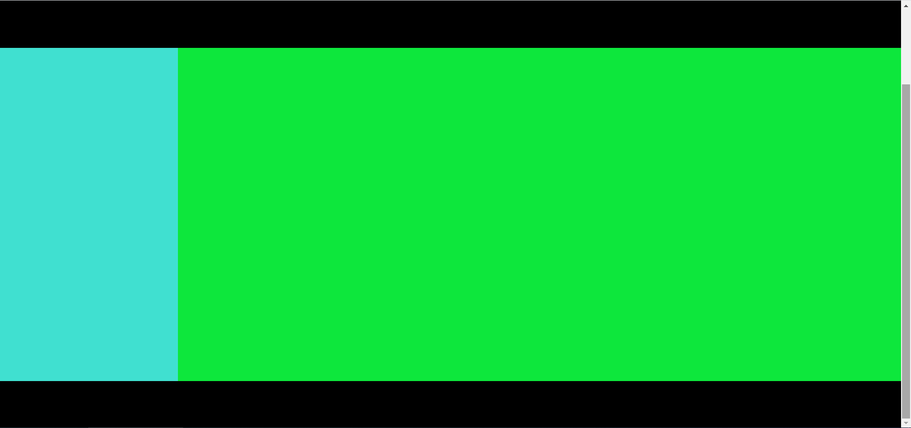
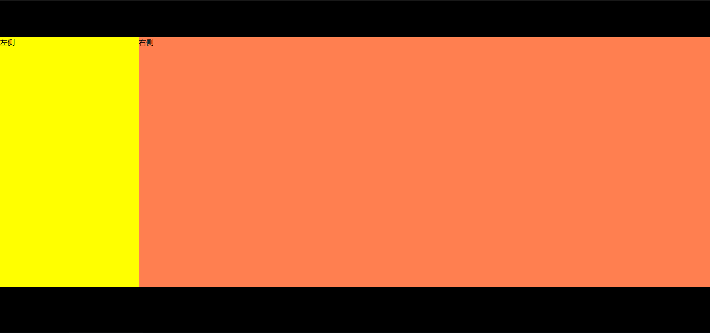
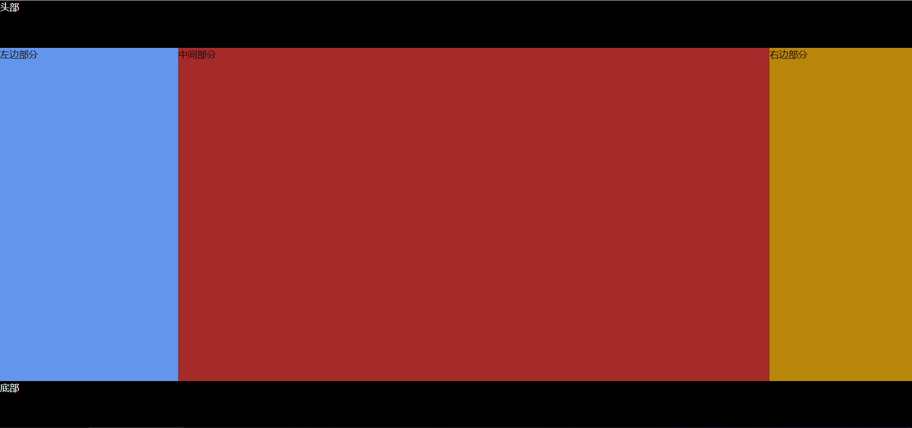
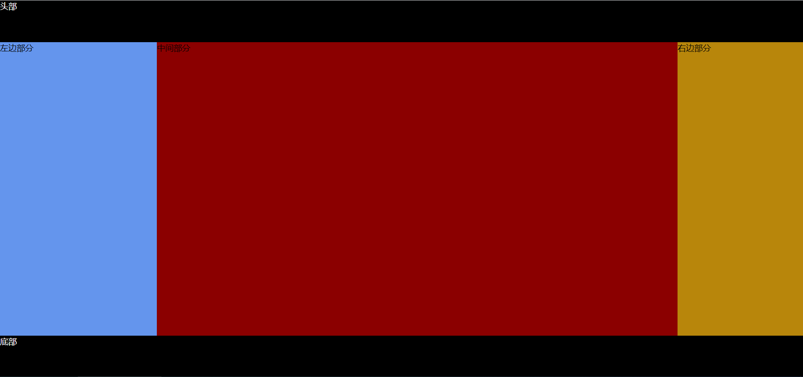

+ # 补充知识点：
> 高度自适应：只有先设置html,body的高度为100%；后面的div设置高度为100%才有效

---

> auto和100%是不一样的，100%是根据元素的像素有关的，auto是自动的。

> 比如：给box下添加一个div高度是100%，这时候div高度为box高度300px；

> 这时候如果给这个div设置padding，那么这个div的高度等于box的高度+padding的像素之和。

---

> 正常文档流下，块级元素的宽度等于父元素的宽度，高度为内容撑开的高度;

> 内联元素的高度宽度都是内容撑开的高度宽度;

> 设置绝对定位/固定定位/浮动会脱离文档流;

> 脱离文档流下，块级元素的宽度是内容撑开的宽度，高度还是内容撑开的高度;

> 给内联元素设置绝对定位/固定定位/浮动,内联元素就会有块元素的特点。

---

> box-sizing属性可以被用来调整这些表现：

> content-box是默认值,设置的边框和内边距的值是不包含在你设置的width内的;

> border-box:设置的边框和内边距的值是包含在你设置的width内的
# 一、百分比布局
#### DOM结构如下：
```
    <div id="app">
        <div class="iHeader"></div>
        <div class="iContent">
            <div class="iLeft"></div>
            <div class="iRight"></div>
        </div>
        <div class="iFooter"></div>
    </div>
```
#### CSS内容如下：
```
        *{ 
            margin: 0; 
            padding: 0; 
            box-sizing: border-box; 
        }
        html,body{ 
            /* 先设置html,body的高度为100%，后面的div设置高度为100%才有效 */
            height: 100%; 
        }
        div#app{ 
            height: 100%; 
            background: slateblue; 
        }
        .iHeader,.iFooter{ 
            height: 80px; 
            background: #000; 
        }
        .iContent{ 
            width: 100%;
            height: 100%; 
            background: tomato; 
            overflow: hidden; 
        }
        .iLeft{ 
            float: left; 
            width: 300px; 
            height: 100%; 
            background: turquoise; 
        }
        .iRight{ 
            height: 100%; 
            overflow: hidden; 
            background: rgb(13, 231, 60); 
        }
```
#### 效果图如下：

# 二、两栏布局
### 头部固定高度左右结构高度自适应窗口高度底部固定高度
#### DOM结构如下：
```
    <div class="iTop"></div>
    <div class="iCenter">
        <div class="iLeft">左侧</div>
        <div class="iRight">右侧</div>
    </div>
    <div class="iBottom"></div>
```
#### CSS内容如下：
```
        *{ 
            margin: 0; 
            padding: 0; 
            box-sizing: border-box;
        }
        html,body{ 
            height: 100%; /* 先设置html,body的高度为100%，后面的div设置高度为100%才有效 */
            overflow: hidden; 
        }
        .iTop{ 
            width: 100%; 
            height: 80px; 
            background: #000; 
        }
        .iCenter{ 
            width:100%; 
            background:#30C; 
            /* 通过设置绝对定位来让它高度自适应窗口(相对的是浏览器窗口) */
            position:absolute; 
            top:80px; 
            bottom:100px; 
        }
        .iLeft{ 
            /* 设置浮动，脱离基本文档流 */
            float: left; 
            width: 300px; 
            height:100%; 
            background:#FF0; 
        }
        .iRight{ 
            height: 100%; 
            overflow: hidden; 
            background: coral; 
        }
        .iBottom{ 
            width:100%; 
            height:100px; 
            background:#000; 
            position:absolute; 
            bottom:0; 
        }
```
#### 效果图如下：

# 三、三栏布局
#### 三栏布局最经典的就是圣杯布局和双飞翼布局，都是两边固定宽度，中间自适应的三栏布局，其中，中间栏放到文档流前面，保证先行渲染。
#### 解决方案大体相同，都是三栏全部float:left浮动，区别在于解决中间栏div的内容不被遮挡住上；
#### 圣杯布局是左右两栏添加相对定位，并配合left和right属性；
#### 而双飞翼布局是在中间栏的div中再嵌套一个div，内容写在嵌套的div里，然后对嵌套的div设置margin-left和margin-right，效果上表现为左右两栏再中间栏的上面，中间栏还是100%宽度，只不过中间栏的内容通过margin的值显示再中间。

+ ## 圣杯布局
#### DOM结构如下：
```
    <div class="iTop">头部</div>
    <div class="iMain">
        <div class="iMiddle">中间部分</div>
        <div class="iLeft">左边部分</div>
        <div class="iRight">右边部分</div>
    </div>
    <div class="iFooter">底部</div>
```
#### CSS内容如下：
```
        *{ 
            margin: 0; 
            padding: 0; 
            box-sizing: border-box; 
        }
        .iTop,.iFooter{ 
            height: 80px; 
            background: #000; 
            color: #fff; 
        }
        .iMain{ 
            /*设置padding是为了摆正中间栏的位置，左右栏通过添加负的margin放到正确的位置了*/
            padding: 0 240px 0 300px; 
            overflow: hidden; 
        }
        .iMain div{ 
            float: left; 
            height: 562px; 
        }
        .iMiddle{ 
            width: 100%; /*中间栏上去到第一行*/
            background: brown; 
        }
        .iLeft{ 
            width: 300px; 
            margin-left: -100%; 
            /*中间栏的位置摆正之后，左栏的位置也相应右移，通过相对定位的left恢复到正确位置*/
            position: relative; 
            left: -300px; 
            background: cornflowerblue; 
        }
        .iRight{ 
            width: 240px; 
            margin-left: -240px;
            /*中间栏的位置摆正之后，右栏的位置也相应左移，通过相对定位的right恢复到正确位置*/
            position: relative; 
            right: -240px; 
            background: darkgoldenrod; 
        }
```
#### 效果图如下：

+ ## 双飞翼布局
#### DOM结构如下：
```
    <div class="iTop">头部</div>
    <div class="iMain">
        <div class="iWarp">
            <div class="iMiddle">中间部分</div>
        </div>
        <div class="iLeft">左边部分</div>
        <div class="iRight">右边部分</div>
    </div>
    <div class="iFooter">底部</div>
```
#### CSS内容如下：
```
        *{ 
            margin: 0; 
            padding: 0; 
            box-sizing: border-box; 
        }
        .iTop,.iFooter{ 
            height: 80px; 
            background: #000; 
            color: #fff; 
        }
        .iMain{ overflow: hidden; }
        .iMain .iWarp,.iMain .iLeft,.iMain .iRight{
            float: left; 
            height: 562px; 
        }
        .iWarp{ 
            width: 100%; /*中间栏上去到第一行*/
            background: darkred; 
        }
        .iWarp .iMiddle{ 
            /*给内部div添加margin，把内容放到中间栏，其实整个背景还是100%*/ 
            margin: 0 240px 0 300px; 
        }
        .iLeft{ 
            width: 300px; 
            /*左栏设置负margin值来摆正位置*/
            margin-left: -100%; 
            background: cornflowerblue; 
        }
        .iRight{ 
            width: 240px; 
            /*右栏设置负margin值来摆正位置*/
            margin-left: -240px; 
            background: darkgoldenrod; 
        }
```
#### 效果图如下：
